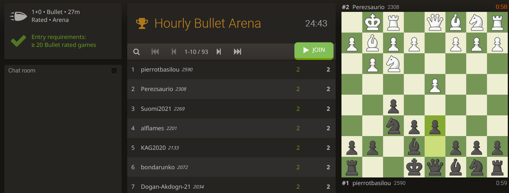

# Lichess with chess.com-design
This extension will change the design of all the pieces and boards on [lichess.org](https://lichess.org/) to the default [chess.com](https://chess.com/) design 
## Appearance

## Comparison
